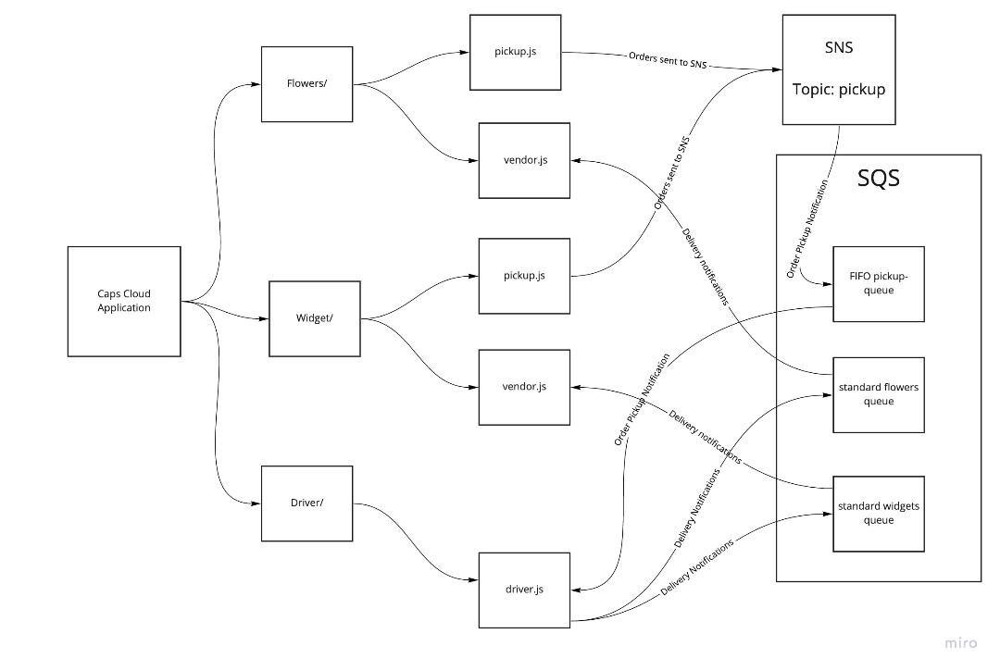

# caps-cloud-system

### Using only AWS Services: SQS, SNS, Lambda, create a cloud version of the CAPS system

### Required Services
- SNS **Topic**: *pickup which will receive all pickup requests from vendors*

- SQS **Queue (FIFO)**: packages which will contain all delivery requests from vendors, in order of receipt.

- Subscribe this queue to the pickup topic so all pickups are ordered

- SQS Queue (Standard) for each vendor (named for the vendor) which will contain all delivery notifications from the drivers

### Operations

**Vendors**

- Vendors will post “pickup” messages containing delivery information into the SNS pickup topic
   -   { orderId: 1234, customer: "Jane Doe", vendorId: queueArn}
   -   Note the queueArn – this refers to the AWS ‘arn’ of the vendor’s specific delivered queue
- Pickup requests should be moved into a FIFO queue for the drivers automatically
- Vendors should separately subscribe to their personal SQS queue and periodically poll the queue to see delivery notifications

### Drivers:
- Drivers will poll the SQS packages queue and retrieve the next delivery order (message)
- After a time (e.g. 5 seconds), drivers will post a message to the Vendor specific SQS Queue using the queueArn specified in the order object

#### Implementation Notes

- pickup.js

    - The order id and customer name can be randomized
    - The queueArn must be the arn from the Queue you created for the vendor

- vendor.js
    - vendor.js should be an SQS Subscriber
      Connect it to the vendor’s queue by using it’s URL/ARN
    - As drivers deliver, this app will      continually poll the queue, retrieve them, and log details out to the console
   -   you should be able to disconnect this app, and see deliveries that happened while the app was not running

- driver.js
    - Connect to the packages queue and get only the next package
    - Wait a random number of seconds
    - Post a message to the Vendor Queue (using the supplied arn) to alert them of the delivery
    - Repeat until the queue is empty

*********NOTE FROM JOHN**********

Vendor publishes to a pickup queue up a package for pickup.
   - Drivers need to be consumers of this queue, so they can get their delivery list even if they go offline
When a driver picks up a delivery, they send a notice to an SNS “in-transit” topic. (Because “in-transit” isn’t super important, it’s ok for it to just be a message that might get missed)
  - Vendors should subscribe to this topic so they can see real-time messages
When the driver delivers, they publish to the delivered queue.
   - Vendors should be a consumer of this queue so they can “see” when packages are delivered even if they go offline.

So, use a combination of all the things. Your .js files will be sending and receiving messages as before,  but using the AWS services and connector code instead of socket.io and a homegrown hub.js

